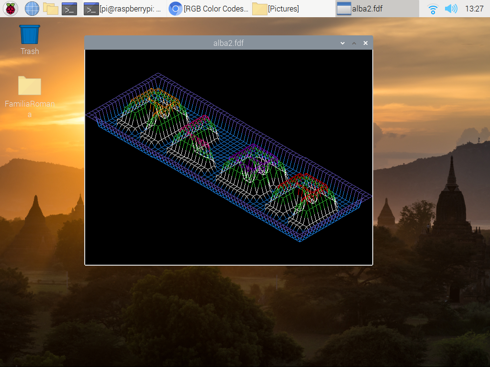
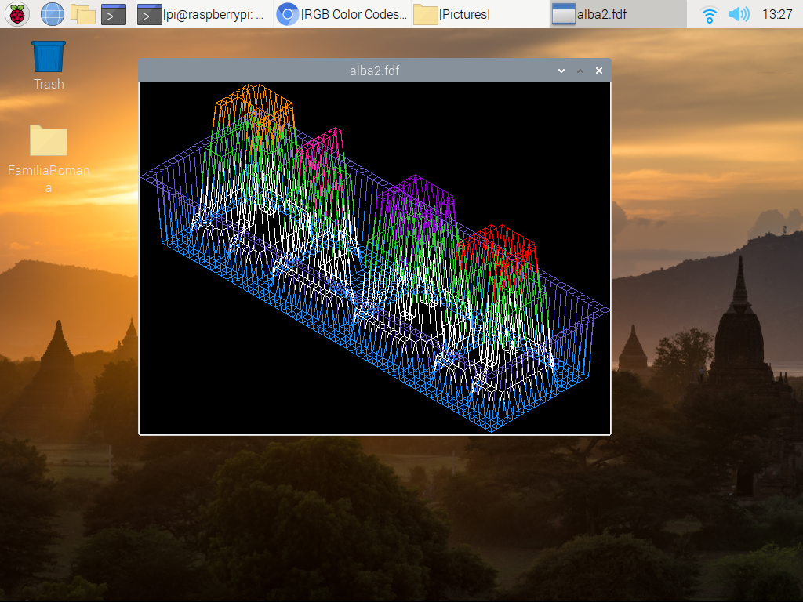
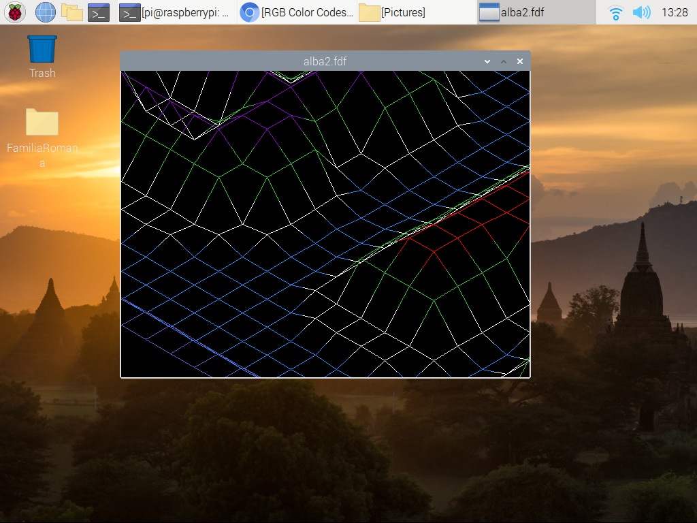

# FdF

**Resolution of `common-core-rank02/FdF` (version 3) project, *mandatory* & 3/5 of the *bonus* parts.**

## FdF features

- The entire program has been constructed with 32-bit integer variables! There isn't a single `long`, `float`, or `double` in the code. Both the zoom and the displacement are agile and the response is immediate. This, I found, was the only way to get my Raspberry Pi to draw 500 × 500 point maps. Color gradients are a bit more resource intensive, but they too are built with `int` variables \[see image src/D.png\].

- Images are buffered to prevent screen-tearing as the pixels are plotted.

- Information is not lost as one manipulates the image. For example, one could zoom in (`Z` key) until reaching *overflow* levels, spoiling the plot, and still undo the movements without data degradation. Likewise, flattening a map to zero with the vertical distortion `J` key is also reversible.

- Out of view lines are not processed, to further improve performance. Segments that do show in the image are still rendered even when the endpoints fall outside the image. *Only the plotted portions are actually calculated*.

## FdF operation

This project responds correctly to the typical window operations, such as the *minimize* and *close* buttons, but the user is meant to interact via the keyboard:

	'ESC'      : quit program
	'R' or 'r' : reload isometric projection
	'W' or 'w' : move up
	'A' or 'a' : move left
	'S' or 's' : move down
	'D' or 'd' : move right
	'Z' or 'z' : zoom in
	'X' or 'x' : zoom out
	'J' or 'j' : scale z down
	'K' or 'k' : scale z up
	'C' or 'c' : toggle color gradation

The default color treatment is to split the segments evenly between the endpoint colors. A more interesting—and quite stunning—effect is accomplished with the color gradiient option (`C` key).

## Screen captures

General view. Map is loaded, centered in the window, and zoomed until it hits the frame. Isometric perspective from the usual octant.

Elevation distorted with the `K` key.

Users may move around the map and zoom in at will. The default color assignment splits segments at the midpoint, with each half taking on the color of its endpoint.

`C` key toggles a stunning color gradation between endpoints.

---

## Simple MiniLibX installation guide, as performed with my Raspberry Pi 2

- Download and install the X11 development package

		sudo apt-get libxext-dev

- Extract the compress file `minilibx-linux.tgz` that contains, among other things, the **MiniLibX** library

		tar -xvf minilibx-linux.tgz -C /target/directory

- Navigate into the folder just created, `minilibx-linux`, and execute its **Makefile**

		make all

- Copy the newly created library (`libmlx.a`) and its header (`mlx.h`) into desired locations of the system. For example,

		sudo cp libmlx.a /usr/local/lib/
		sudo cp mlx.h /usr/local/include/

  NOTE: The alternative `libmlx_Linux.a` library or the *same* `libmlx.a` library compiled from the `sources.tgz` folder, will both make the project crash when the close button of the window is clicked.

- Adapt the **FdF** project's **Makefile** to include the new header and link the appropriate libraries. The compilation and linker options should incorporate the following flags

		CFLAGS = -I/usr/local/include/
		LDFLAGS = -L/usr/local/lib/
		LDLIBS = -lmlx -lXext -lX11

  Notice that the actual libraries are stored in a specialized variable, `LDLIBS`, implicitly used by the linker

#### NOTE: The **Makefile** present in this project extracts, compiles, and archives the desired library into a new folder next to the source code. The *Linux* version searches for it in `resources/`, while the *Mac* version—the actual version evaluated in class—expects the compressed file in the main directory. If these options are not convenient, it is but a simple thing to edit the definition of the `TARMLX` variable.

---

## TODO

Unfortunately, this project was rushed 25 hours before *Blackhole Absorption* and banishment from 42Barcelona. Some features that would have secured a 5/5 *bonus* evaluation had been projected, but had to be dismissed for lack of time:

- Rotations, nicely coded with quaternions

- ON/OFF toggle for the visibility of hidden wires

- Cycle between all eight octants for the direction of the isometric projection

- Some conic perspective with two additional keys to control distance from viewer. Perhaps with anoher pair of keys to play with the focal length as well

- On-screen data annotations for the user, again with some ON/OFF toggle. Perhaps some *help* screen too
